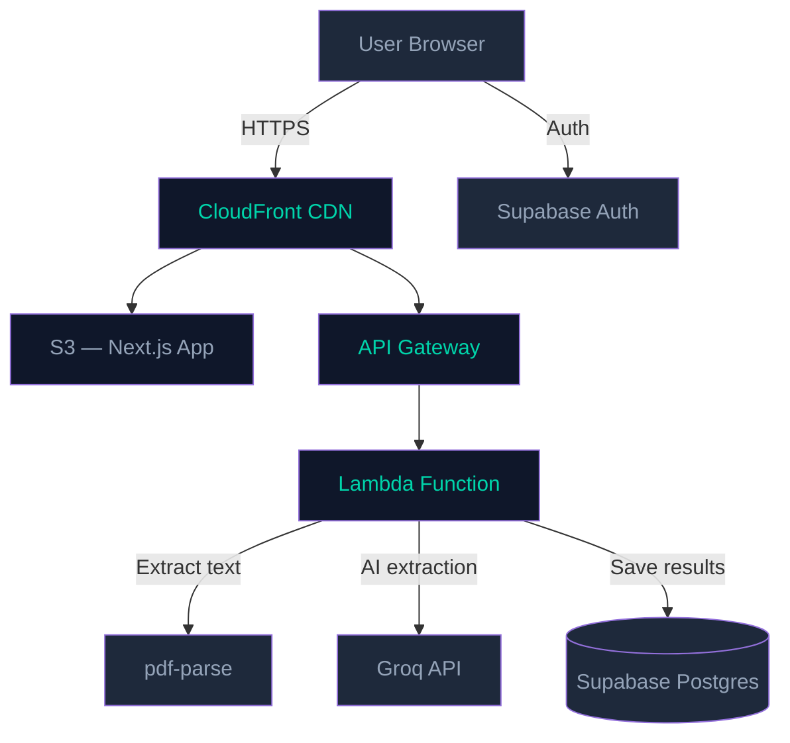

# Axo Longevity — Biomarker Intelligence

Upload any lab report PDF and get an instant breakdown of every biomarker — translated to English, classified as **optimal**, **normal**, or **out of range** based on your age and sex.

Live demo → https://axo-longevity-challenge.vercel.app

---

## Getting started

```bash
git clone https://github.com/jeram/axo-longevity-challenge
cd axo-longevity-challenge
npm install
```

Create a `.env.local` file:

```
GROQ_API_KEY=your_key_here
```

Get a free key at [console.groq.com](https://console.groq.com) — no credit card needed.

```bash
npm run dev
```

Open [http://localhost:3000](http://localhost:3000) and upload a lab report PDF.

---

## How it works

The flow is pretty straightforward. You upload a PDF, the server pulls out the raw text, sends it to an AI model to extract and translate all the biomarkers into structured JSON, and then a classifier decides whether each value is optimal, normal, or out of range based on the patient's age and sex from the report.

```
Upload PDF
   │
   ▼
Extract text (pdf-parse)
   │
   ▼
Groq API — Llama 3.3 70B
  • Translate to English
  • Parse values + units
  • Identify reference ranges
   │
   ▼
TypeScript classifier
  • Out of range  → outside lab's reference range
  • Normal        → within range, not optimal
  • Optimal       → within evidence-based performance range
   │
   ▼
Results dashboard
```

---

## Classification

Most lab reports just tell you if something is in or out of range. This goes one step further — it also flags whether a value is truly *optimal* for long-term health and performance, not just "acceptable."

| Status | Meaning |
|---|---|
| 🟢 Optimal | Within evidence-based performance range (e.g. LDL <70, HbA1c <5.0%) |
| 🟡 Normal | Within the lab's reference range, but could be better |
| 🔴 Out of Range | Outside the lab's printed reference range |

Ranges are adjusted per sex where it matters — hemoglobin, hormones, creatinine, etc.

---

## Tech stack

| | |
|---|---|
| Framework | Next.js 14 (App Router) |
| Language | TypeScript |
| Styling | Tailwind CSS v4 |
| AI | Groq API (Llama 3.3 70B) |
| PDF parsing | pdf-parse |
| Icons | Lucide React |

I'd normally use Claude or GPT-4 for this kind of extraction work — they handle edge cases better. But since this is a demo, Groq's free tier does the job well enough and requires no credit card.

---

## Project structure

```
src/
├── app/
│   ├── page.tsx                    # Upload page
│   ├── results/page.tsx            # Results dashboard
│   └── api/analyze/route.ts        # Main endpoint
├── components/
│   ├── upload/UploadZone.tsx
│   └── results/
│       ├── PatientCard.tsx
│       ├── SummaryStats.tsx
│       ├── FilterBar.tsx
│       ├── CategorySection.tsx
│       ├── BiomarkerRow.tsx
│       └── RangeBar.tsx
└── lib/
    ├── groq.ts                     # AI extraction + prompt
    ├── classifier.ts               # Classification logic
    ├── optimal-ranges.ts           # Evidence-based ranges
    └── pdf-parser.ts               # PDF text extraction
```

---

## Production deployment

For a real production setup I'd go with AWS + Supabase:



| Service | Why |
|---|---|
| **S3 + CloudFront** | Host the Next.js app with global CDN |
| **API Gateway + Lambda** | Serverless analyze endpoint — scales to zero when idle |
| **Supabase Auth** | User login so results are tied to an account |
| **Supabase Postgres** | Store analysis history per user with row-level security |

PDFs would be uploaded directly to S3 via presigned URLs so they never pass through the app server. GDPR-compliant with EU region hosting.

---

For informational purposes only. Not medical advice.
